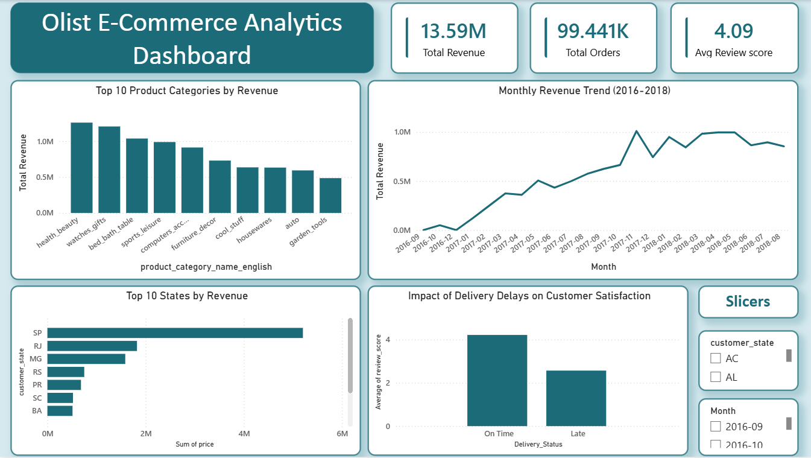

# Olist E-Commerce Analytics Dashboard

End-to-end analytics project on the Olist Brazilian E-Commerce dataset — from raw CSVs to a polished Power BI dashboard, covering data cleaning, SQL analysis, and Python visualization.

## Dataset

[Olist Brazilian E-Commerce Public Dataset](https://www.kaggle.com/datasets/olistbr/brazilian-ecommerce) — ~100K orders placed between 2016-2018 across 9 relational tables (customers, orders, order items, payments, reviews, products, sellers, geolocation, category translations).

## Tools Used

- **Python (pandas)** — data cleaning and ETL
- **MySQL** — relational database, data storage
- **SQL** — analysis (joins, aggregations, `CASE WHEN`, subqueries, window functions)
- **Matplotlib / Seaborn** — exploratory visualizations
- **Power BI** — interactive dashboard

## Process

### 1. Data Cleaning (pandas)
- Removed ~262K duplicate rows from `geolocation` (26% of the table)
- Handled missing values with judgment rather than blanket drops:
  - Missing `product_category_name` (610 rows) filled as "unknown" rather than dropped
  - Missing delivery dates in `orders` left as null — these represent genuinely cancelled/undelivered orders, not data errors
  - Missing review comments filled with empty strings — most reviews are score-only, no comment
- Flagged ~16,640 order items (15%) as price outliers via IQR, but retained them since they represent legitimate premium-category sales, not data errors
- Joined `product_category_name_translation` to get English category names
- Found and documented a real data inconsistency: 8 orders marked "delivered" with no delivery date on record

### 2. SQL Analysis (MySQL)
10 queries covering revenue trends, category/state breakdowns, delivery performance, and review scores — including `CASE WHEN` logic and a window function (`RANK()` over a subquery) for category ranking. Full queries in `olist_analysis.sql`.

### 3. Visualization (Python)
5 charts built with Matplotlib/Seaborn: monthly revenue trend, top categories, revenue by state, price outlier distribution, and delivery-vs-review comparison.

### 4. Dashboard (Power BI)
Interactive dashboard with 3 KPI cards, 4 visuals, and 2 slicers (state, month) for live filtering.

## Key Findings

- **Delivery reliability strongly predicts satisfaction**: orders delivered on time average a **4.21** review score vs **2.57** for late orders — a 1.6-point gap.
- **~7.9% of orders were delivered late** relative to the estimated delivery date.
- **São Paulo (SP) dominates**: ~5.2M in revenue, more than 2.8x the next-highest state (Rio de Janeiro).
- **Top category**: health & beauty (~1.26M revenue), followed by watches/gifts and bed/bath/table.
- Average delivery time across all orders: **~12.5 days**.

## Dashboard
## Dashboard



## Repository Structure

```
├── README.md
├── cleaning_pipeline.ipynb       # pandas cleaning + MySQL load
├── olist_analysis.sql            # 10 SQL analysis queries
├── analysis_charts.ipynb         # Matplotlib/Seaborn visualizations
└── dashboard_screenshot.png      # Dashboard preview image
```

> The Power BI (`.pbix`) file exceeds GitHub's file size limit and isn't hosted directly in this repo — happy to share it on request.

## Notes on Data

- Dataset's effective range is 2016-09 to 2018-08; a small number of 2018-09/2018-10 records were excluded from trend charts as extraction artifacts (near-zero row counts, incomplete months).
- "Revenue" is defined as product `price` only, excluding freight/shipping charges.
